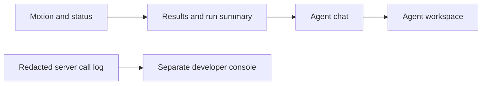

# Agent UI issue reconciliation

Scope: open issues #242–#251, reviewed against `df55296`.
Application-specific loan logic stays in the reference application. Published
contracts remain compatible. No npm publication is part of this task.

| Issue | Implementation target | Validation |
| --- | --- | --- |
| #242 | Motion snippets, stagger, disclosure, reduced-motion policy | CSS contracts and reduced motion |
| #243 | Shared status vocabulary and accessible icon; trace/approval adoption | Mapping and component tests |
| #244 | Serializable result blocks and semantic renderers | Escaping, safe links, overflow, IDs |
| #245 | Collapsed run summary with plan and elapsed clock | Timing, disclosure, cleanup |
| #246 | Message extensions, identity, completeness and NDJSON | UTF-8 splits, gaps, duplicates, cancellation |
| #247 | Approval decision versus outcome; pending/failed UI | Async decisions, scoped anchors |
| #248 | Intent-based scroll, jump, IME-safe composer | Input, scroll, focus and cleanup |
| #249 | Conversation controller and responsive workspace | Persistent sessions and drawers |
| #250 | Call console and server-only redacted logging | Redaction, RPC errors, SSE, copy/filter |
| #251 | Agent UI composition guidelines | Docs build and links |

## Verification record

All ten issues are implemented on `codex/agent-ui-issues`. Documentation,
entrypoints, generated element maps and workshop metadata are synchronized.

- `bun run verify`: passed 240 test files / 2,147 tests, core/server/framework
  typechecks, package builds and React/Angular/Vue/Svelte consumer validation,
  including React and Svelte server rendering. Statement coverage: 86.23%.
- Focused workspace, trace-animation and call-console checks: 35 tests passed;
  the final full run includes the additional settle-animation regression test.
- `bun run docs:typecheck`, `bun run docs:build`, and `bun run storybook:extract`:
  passed.
- Box conformance, color and web-app audits: passed with no unaccepted drift.
- Chrome interaction checks at 1440×1000 and 390×844: run disclosure, independent
  mounted chats, mobile drawers/Escape, reduced motion, dark token overrides,
  result-table region, HTTP-200 tool-error filtering, keyboard split resizing
  and clipboard copy passed, with no page errors. Browser-plugin skill was
  unavailable; the existing Playwright installation and Chrome were used.
- Screenshot review fixed a rounded mobile scrim, full-height conversation
  layout, narrow call-row wrapping and a missing accessible name on the
  run-summary disclosure.
- Pinned-container screenshot baseline refresh and strict pixel check: passed,
  14/14 gallery and 57/57 documentation images. Updated the intentional chat
  presentation and documentation-navigation baselines; discarded byte-only
  gallery rewrites with identical pixels.

## Delivery boundaries

No live agent/provider credentials were used. Transport and authorization
behavior is covered with fixtures; application owners must wire their own
transport and developer-console access control. Framework adapters keep their
existing API; the new core elements are usable directly or through generic
adapter helpers. No additional framework-specific wrappers were introduced.

Delivery branch: `codex/agent-ui-issues`. No publication or merge is part of
this implementation. Issues remain open until the implementation is reviewed
and delivered. Next: open an implementation PR referencing #242–#251.
