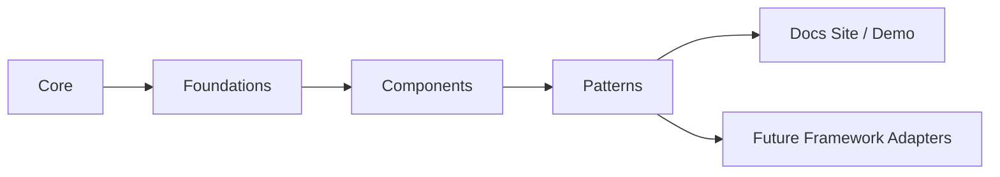

# Architecture

`box-open-elements` is a framework-agnostic design system and web component library. It uses a layered structure:

1. `src/core`
   Shared runtime: typed event emitter and the controller base class.
2. `src/foundations`
   Design decisions as data: the design-token registry, token bundles, iconography, and theming APIs.
3. `src/components`
   Accessible Web Components for single controls, organized by category.
4. `src/patterns`
   Workflow areas grouped by Box noun. Each area owns its headless controllers, transport contracts, and composed surfaces together.
5. Future adapter packages
   React, Vue, Angular integrations built on top of the headless layer.

## Taxonomy Diagram

For the full tier and category map, see [taxonomy.md](./taxonomy.md).

## Why this is useful

The upstream `box-ui-elements` wrappers expose an imperative API but still mount React internally. This package is a true headless-first design: rendering is an adapter concern, not a core dependency.

## Public API shape

The public API should prefer:

- constructors and factory functions
- plain objects for state snapshots
- explicit commands such as `connect()`, `disconnect()`, `select()`, `navigateTo()`
- event subscription via a typed emitter
- injected transport interfaces for network access

## Transport boundary

The core should not know about `fetch`, React Query, Axios, or any Box SDK directly.

Instead, each workflow controller depends on a narrow transport contract. For example, the content explorer only needs a way to request the current folder's items. That keeps the core:

- easy to test
- portable across frameworks
- free to run in browsers, SSR environments, or other hosts with different networking stacks

The transport can still expose API-native concepts like pagination metadata, but the controller should translate that into stable state and commands such as `reload()` and `loadNextPage()`.

For the recommended server-side Box boundary and data-source contract model, see [integration/box-server.md](./integration/box-server.md).

## Headless-first patterns

Workflow patterns should begin as headless behavior (controllers plus contracts) and then gain presentation adapters. The content explorer decomposition in [patterns/content-explorer.md](./patterns/content-explorer.md) is the reference example: session, navigation, collection, selection, and actions are independent headless blocks that any UI can consume.

## Design principles

- Keep state and business logic separate from rendering.
- Expose controllers and stores rather than framework components.
- Make React, Vue, Angular adapters optional layers on top of the Web Components and headless layer.
- Prefer boring, guessable APIs over clever ones.
- Keep collection primitives compatible with pagination, infinite scroll, and future windowing.
- Treat accessibility semantics and keyboard support as part of the component contract.

## Non-goals for the first phase

- porting every component from `box-open-web-components` at once
- supporting every Box element immediately
- reproducing every behavior from `box-ui-elements`

The previous repo remains the reference implementation for everything not yet rebuilt here; see [migration-map.md](./migration-map.md) for the component-by-component mapping.
