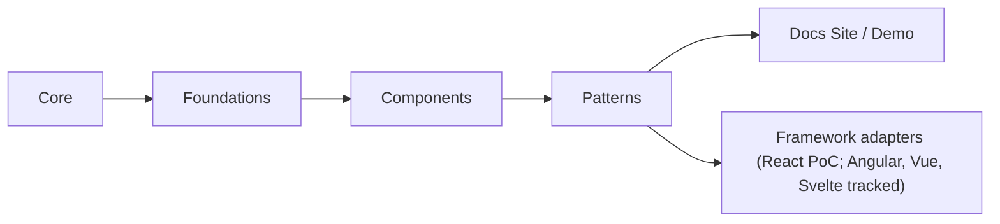
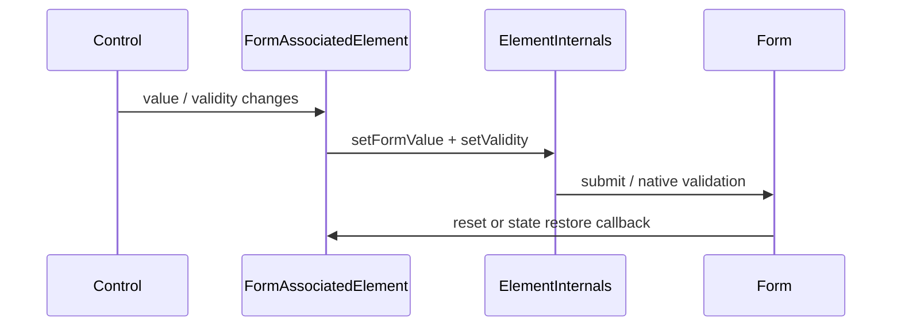

# Architecture

`box-open-elements` is a framework-agnostic design system and web component library. It uses a layered structure:

1. `src/core`
   Shared runtime: typed event emitter, controller base class, and `BaseElement`
   (the Web Component base that builds shadow DOM once and patches in place).
2. `src/foundations`
   Design decisions as data: the design-token registry, token bundles, iconography, and theming APIs.
3. `src/components`
   Accessible Web Components for single controls, organized by category.
4. `src/patterns`
   Workflow areas grouped by Box noun. Each area owns its headless controllers, transport contracts, and composed surfaces together.
5. Optional adapter packages
   Framework integrations on top of the Web Component layer — React PoC in
   `packages/react` (`@box-open-elements/react`); Angular, Vue, and Svelte are
   tracked future lanes.

## Taxonomy Diagram

For the full tier and category map, see [taxonomy.md](./taxonomy.md).

## Why this is useful

The upstream `box-ui-elements` wrappers expose an imperative API but still mount React internally. This package is a true headless-first design: rendering is an adapter concern, not a core dependency.

## Public API shape

The public API should prefer:

- constructors and factory functions
- plain objects for state snapshots
- explicit commands such as `connect()`, `disconnect()`, `select()`, `navigateTo()`
- event subscription via a typed emitter
- injected transport interfaces for network access

## Transport boundary

The core should not know about `fetch`, React Query, Axios, or any Box SDK directly.

Instead, each workflow controller depends on a narrow transport contract. For example, the content explorer only needs a way to request the current folder's items. That keeps the core:

- easy to test
- portable across frameworks
- free to run in browsers, SSR environments, or other hosts with different networking stacks

The transport can still expose API-native concepts like pagination metadata, but the controller should translate that into stable state and commands such as `reload()` and `loadNextPage()`.

For the recommended server-side Box boundary and data-source contract model, see [integration/box-server.md](./integration/box-server.md).

## Headless-first patterns

Workflow patterns should begin as headless behavior (controllers plus contracts) and then gain presentation adapters. The content explorer decomposition in [patterns/content-explorer.md](./patterns/content-explorer.md) is the reference example: session, navigation, collection, selection, and actions are independent headless blocks that any UI can consume.

## Web Component render contract

Catalog and pattern custom elements extend `BaseElement` from `@unofficialbox/box-open-elements/core`:

- `renderTemplate()` — build the shadow DOM (styles + structure) once on first connect
- `setupListeners()` — attach listeners once to stable nodes (prefer event delegation for lists)
- `update()` — mutate text, classes, attributes, and `aria-*` in place on state change

Do **not** reassign `shadowRoot.innerHTML` from `attributeChangedCallback` or property setters.
Full rebuilds destroy focus, drop in-progress input, break drag/pointer capture, and kill CSS
transitions. Dynamic lists may rebuild a dedicated list container inside `update()`; keep the
outer shell and listeners stable. Focused inputs should not overwrite `.value` while focused.

## Form-associated controls

Everyday form controls extend `FormAssociatedElement` (`static formAssociated = true`) so they
participate in native `<form>` submission via `ElementInternals`:

- `name` — form field name
- `invalid` + `error-message` — validation UI (`aria-invalid`, `aria-errormessage`,
  `part="error-message"` alert region) styled with `--boe-token-surface-status-surface-error`
- `syncFormAssociation()` — push the current value/validity into internals (call on value change)
- `formResetCallback` / `formStateRestoreCallback` — restore defaults / autocomplete state

Shared helpers: `boeFormFieldErrorStyles`, `formErrorMessageMarkup`, `getMirroredFormValue`
(jsdom-friendly mirror of `setFormValue`), `formDataFromNamedValues` / `stringValuesFromFormValue`
(multi-select), `formDataFromRange` / `rangeFromFormValue` (range pairs), and
`applyInvalidStateToControls` for multi-focusable fields. See
[api-guidelines.md](./api-guidelines.md).

## Design principles

- Keep state and business logic separate from rendering.
- Expose controllers and stores rather than framework components.
- Make React, Angular, Vue, and Svelte integrations optional layers on top of the Web Components and headless layer. React starts as `@box-open-elements/react`; validate native custom-element consumption before creating more wrapper packages (see [integration/framework-adapters.md](./integration/framework-adapters.md)).
- Prefer boring, guessable APIs over clever ones.
- Keep collection primitives compatible with pagination, infinite scroll, and future windowing.
- Treat accessibility semantics and keyboard support as part of the component contract.
- Prefer in-place shadow DOM updates (`BaseElement`) over full `innerHTML` rebuilds.

## Scope boundary after catalog parity

Phases 0–5 and the scoped gap inventory are complete. Future additions are
gap-driven rather than a blanket effort to reproduce every `box-ui-elements`
surface or behavior. Use the predecessor and upstream implementations as
research inputs, then apply this repo's taxonomy, API, accessibility, and
transport rules deliberately. The few remaining generic-component gaps are
intentionally explorer-bound.
