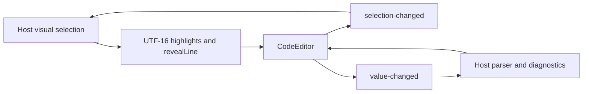

# Code editor

`box-code-editor` is an optional CodeMirror 6 integration. It is deliberately
excluded from the root catalog's runtime exports: import the flat entrypoint.
CodeMirror packages are optional dependencies; deployments that omit optional
dependencies cannot import this component. Other components remain independent.

```ts
import { CodeEditor } from "@unofficialbox/box-open-elements/code-editor";
const editor = document.querySelector("box-code-editor") as CodeEditor;
editor.language = "typescript"; // also go or javascript
editor.value = 'flow().step("Read file");';
editor.completions = [{ label: "step", type: "method" }];
editor.problems = [{ line: 1, col: 1, endCol: 5, message: "Unknown builder", tone: "error" }];
editor.addEventListener("value-changed", event => {
  // Validate and save event.detail.value through your host application.
});
editor.revealLine(1);
editor.selection = { anchor: 0, head: 4 }; // zero-based document offsets
```

Edits emit `value-changed` after 200ms without input, flushed on blur and detach.
Programmatic value updates are silent, excluded from typing history, and preserve the editor instance. Use
`setValue(text, { addToHistory: true })` only for an intentional undoable replacement. The
`readonly` property/attribute disables editing. Diagnostics use one-based lines
and columns; stale out-of-document lines are ignored. Previous/Next problem
buttons select and announce diagnostics. Control-Space opens host completions.

## Host integration

`selection-changed` emits `{ anchor, head }` immediately when the cursor or range
changes. Offsets use UTF-16, as JavaScript strings do. A host can select a step in
its visual builder from this event; setting an identical selection does not emit.
Diagnostics can instead supply `{ from, to, message, tone }`; finite offsets are
clamped to the document and take precedence over line/column positions.

```ts
editor.wrap = true; // or the wrap attribute
editor.highlights = [{ from: 20, to: 80 }];
editor.revealLine(3, { center: true });
editor.completionSource = context => ({
  from: context.pos,
  options: [{ label: "load.files", type: "function" }],
});
```

`completionSource` accepts CodeMirror's synchronous or asynchronous
`CompletionSource` contract and overrides the static list until cleared.
`highlights` tint all intersected lines and add a left bar. They expose
`::part(highlight)` and `--boe-code-highlight-background`. Hosts update ranges
after document changes; out-of-range offsets are safely clamped.



Highlighting, line numbers, folding, search, bracket matching and history use
[CodeMirror's basic setup](https://codemirror.net/examples/basic/). Tab indents;
Escape followed by Tab leaves the editor, following
[CodeMirror's keyboard escape contract](https://codemirror.net/examples/tab/).
The same instruction appears below the editor. Tokens control light/dark
surfaces and highlighting; `--boe-code-editor-height` controls the scroll height.

Hosts own parsing, compilation and persistence. The component does not execute
code or infer application-specific diagnostics.
