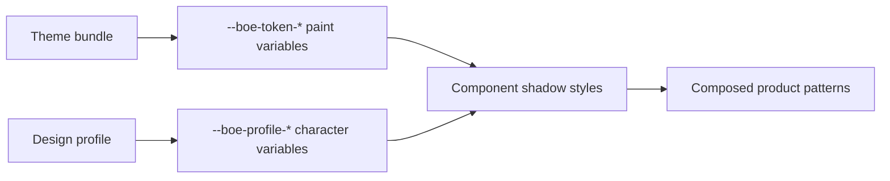

# Design Profiles

Design profiles control the visual character that sits above color theming:
density, spacing, radii, control geometry, typography, elevation, and motion.
They let the same components feel like different products without forking their
markup or behavior.

## Theme, profile, and product pattern

| Layer | Controls | Example |
| --- | --- | --- |
| Theme | colors, status paint, icons, illustrations | Box light versus Box dark |
| Design profile | density, geometry, type, elevation, motion | Box-default versus compact-neutral |
| Product pattern | navigation, information architecture, workflows | content explorer versus issue workspace |

A profile can make controls and surfaces feel much closer to another product
language. It does not automatically replace navigation structure or product
workflows.



## Quick start

```ts
import {
  createDesignProfileController,
} from "@unofficialbox/box-open-elements/foundations/profiles";

const profile = createDesignProfileController({
  profile: "compact-neutral",
});

profile.start();
profile.setProfile("box-default");
```

The controller:

- registers the built-in `box-default` and `compact-neutral` profiles
- persists the selected profile in `boe-design-profile`
- applies `--boe-profile-*` properties to a root
- removes stale properties when switching profiles
- sets `data-design-profile`
- dispatches the bubbling, composed `boe:design-profile-change` event

Set `storageKey: null` for a non-persistent preview. Use `root` to scope a
profile to an embedded application or specimen.

## Author a profile

The schema is deliberately semantic and grouped by responsibility:

```ts
import {
  registerDesignProfile,
} from "@unofficialbox/box-open-elements/foundations/profiles";

registerDesignProfile({
  name: "linear-inspired",
  radius: {
    control: "6px",
    medium: "6px",
    large: "8px",
    field: "8px",
    nav: "6px",
  },
  density: {
    controlHeight: "28px",
    controlHeightLarge: "34px",
    controlPaddingInline: "12px",
    panelPadding: "10px",
    panelGap: "8px",
    overlayPadding: "6px",
    overlayItemMinHeight: "28px",
  },
  typography: {
    fontFamilyBase: "InterVariable, Inter, sans-serif",
    controlFontSize: "12px",
    controlLetterSpacing: "0",
  },
  elevation: {
    inputInset: "none",
    overlay: "0 8px 24px rgb(0 0 0 / 18%)",
    modal: "0 12px 32px rgb(0 0 0 / 22%)",
  },
  motion: {
    interactive: "100ms",
    slow: "180ms",
    easingStandard: "cubic-bezier(0.2, 0, 0, 1)",
  },
});
```

Pair that profile with a separately registered color theme. The example is an
interaction-language direction, not a copy of another product's proprietary
assets or exact implementation.

## Schema

| Section | Representative fields |
| --- | --- |
| `spacing` | `space1` through `space12` |
| `radius` | `size`, `medium`, `large`, `control`, `field`, `nav`, `pill` |
| `density` | control heights/padding, panel gap/padding, overlay and modal metrics |
| `typography` | base family, control size/tracking, modal title size |
| `elevation` | panel, overlay, modal, input inset, primary focus shadows |
| `motion` | durations and standard/enter/exit/linear easing |
| `customProperties` | explicit `--*` extensions for experimental profile values |

Use `createDesignProfileStyleText()` for SSR or stylesheet injection and
`applyDesignProfile()` for direct, controller-free application.

## Current coverage

The profile variables back the shared geometry and motion foundations used
across the catalog:

- control, field, navigation, card, panel, menu, popover, and modal radii
- shared spacing, panel gaps, control heights, and control padding
- inherited base font plus common control typography
- shared panel, input, overlay, modal, and focus elevation
- shared transition durations and easing

Some specialized components still contain bespoke dimensions, shadows, or
decorative radii. Those remain intentionally outside the first profile
contract until they can be assigned a reusable semantic role. Profiles already
cover the dominant shared component chrome; they do not promise arbitrary
pixel-level transformation of every illustration, chart, or workflow surface.

## Related

- [Theming](./theming.md) — colors and runtime light/dark switching
- [Design Tokens](./tokens.md) — semantic paint tokens
- [Geometry](./geometry.md) — Box geometry source and shared constants
- [Motion](./motion.md) — timing and reduced-motion policy
