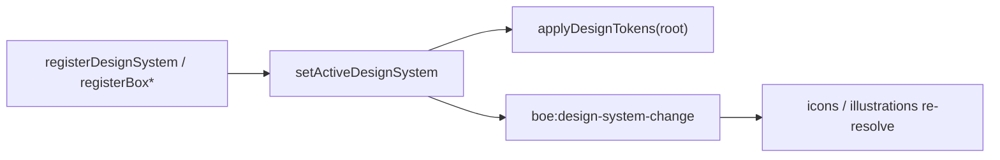

# Theming

Theming is the **runtime lifecycle** around design-system bundles: register, activate, apply, and react when the active theme changes. Token *authoring* and consumption rules live in [tokens.md](./tokens.md); this page covers switching and observing themes.

## What a design system is here

A design system bundle (`DesignSystemDefinition`) is a named package of:

- token map (PascalCase keys → CSS values)
- optional icon renderers
- optional illustration renderers

Built-in bundles: `box-default` (light) and `box-dark` (same keys, dark surfaces/text/strokes/status).

There is no separate theming module under `src/foundations/` — the registry in `src/foundations/tokens/registry.ts` *is* the theming API.

## Lifecycle



| Step | API | Effect |
| --- | --- | --- |
| Register | `registerDesignSystem`, `registerBoxDefaultDesignSystem`, `registerBoxDarkDesignSystem` | Store a named bundle; optional `{ setActive: true }` |
| Activate | `setActiveDesignSystem(name)` | Switch the active name; emits `boe:design-system-change` |
| Apply | `applyDesignTokens(element, name?)` | Write `--boe-token-*` on a root (usually `document.documentElement`) |
| SSR / inject | `createDesignTokenStyleText(name?)` | CSS text block instead of element styles |
| Inspect | `getActiveDesignSystem`, `getDesignSystem`, `listDesignSystems`, `resolveDesignSystemTokens` | Read registry state without mutating it |

## Runtime switch (light ↔ dark)

```ts
import {
  applyDesignTokens,
  registerBoxDefaultDesignSystem,
  registerBoxDarkDesignSystem,
  setActiveDesignSystem,
} from "box-open-elements/foundations/tokens";

registerBoxDefaultDesignSystem();
registerBoxDarkDesignSystem();

setActiveDesignSystem("box-dark");
applyDesignTokens(document.documentElement, "box-dark");
```

The docs-site footer theme toggle uses this exact pattern: flip the active system, then re-apply tokens on the document root.

## Observing theme changes

`setActiveDesignSystem` dispatches a bubbling `CustomEvent` on `globalThis`:

| Detail | Value |
| --- | --- |
| Event name | `boe:design-system-change` (constant `DESIGN_SYSTEM_CHANGE_EVENT`) |
| `detail.activeDesignSystemName` | active name or `null` |

Asset-driven surfaces (for example icon buttons, help icons, illustrations) listen for this event and re-resolve icons/illustrations from the newly active bundle so theme switches update glyphs without a full page reload.

```ts
import { DESIGN_SYSTEM_CHANGE_EVENT } from "box-open-elements/foundations/tokens";

globalThis.addEventListener(DESIGN_SYSTEM_CHANGE_EVENT, () => {
  // re-read resolveDesignIcon / resolveDesignIllustration as needed
});
```

## When to use theming vs other levers

| Need | Use |
| --- | --- |
| Whole-app light/dark or white-label | Register + activate + `applyDesignTokens` (this page) |
| Author or extend token keys | [tokens.md](./tokens.md) bundle definition |
| One-off structural tweak | `::part()` / documented host custom properties |
| Third-party stylesheet → tokens | [Style bridge](../integration/style-bridge.md) |

## Related

- [Design Tokens](./tokens.md) — model, consumption rules, interactive-state helpers
- [Iconography](./iconography.md) — asset resolution through the active design system
- [Brand](./brand.md) — imagery and identity guidance
