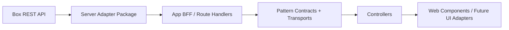

# Box Server Integration

This document defines the recommended boundary between this package and Box server-side logic.

## Goal

Keep `src/` free of:

- Box SDK clients
- access token lifecycle logic
- `as-user` impersonation logic
- REST DTO churn

But still let application code connect Box-backed data to the headless controllers and Web Components with minimal friction.

## Auth direction

Prefer Client Credentials Grant (CCG) for server-side Box access. Use JWT only when supporting an existing Box app that still depends on it.

## Recommended layers



## Separation of responsibilities

### 1. Core package (this repo)

Owns:

- headless controllers
- serializable state contracts
- UI-facing transport interfaces
- provider-neutral adapters

Does not own:

- `box-node-sdk`
- auth configuration
- enterprise impersonation
- server cache or persistence strategy

### 2. Server adapter package

A separate server-oriented package (`packages/box-server`, to be rebuilt from the original scaffold) owns Box integration details:

```text
packages/box-server/
  src/
    auth/
      client.ts
      ccg.ts
      jwt.ts
      oauth.ts
    box/
      explorer-data-source.ts
      metadata-data-source.ts
      share-data-source.ts
    mappers/
      explorer.ts
      metadata.ts
      share.ts
    routes/
      content-explorer.ts
      metadata.ts
      share.ts
```

It can depend on `box-node-sdk@10`, raw Box REST calls, server framework concerns, and caching/retry/tracing/rate-limit handling. Start with `ccg.ts`; only add `jwt.ts` when a concrete deployment requirement exists.

The original scaffold also proved out framework-neutral route helpers (`createContentExplorerRouteHandler()` etc.) that accept a standard `Request` and return a standard `Response`, so they adapt to many server runtimes. Carry that shape forward.

## Pattern contracts

Each workflow area exposes plain, token-free, SDK-free, framework-free data-source interfaces, serializable at the edges:

- `patterns/content-explorer/contracts` — `ContentExplorerDataSource`, `createHttpContentExplorerDataSource()`, `createExplorerTransportFromDataSource()`
- `patterns/metadata/contracts` — `MetadataDataSource`, templates, instances, query
- `patterns/share/contracts` — `ShareDataSource`, shared links, collaborators

Wire schemas live alongside those contracts and define the backend-language-neutral JSON shapes.

## Explorer bridge pattern

To avoid pushing Box-specific logic into the controller transport, adapt a higher-level data source to the controller transport contract:

```ts
import { ContentExplorerController } from "box-open-elements/patterns/content-explorer/controller";
import { createExplorerTransportFromDataSource } from "box-open-elements/patterns/content-explorer/contracts";

const transport = createExplorerTransportFromDataSource(serverBackedExplorerDataSource);

const controller = new ContentExplorerController({
  rootFolderId: "0",
  transport,
});
```

A server-backed transport needs no browser-held token.

## Request flow

1. UI invokes a controller command like `navigateTo()` or `refresh()`
2. controller calls a narrow transport or data-source contract
3. app transport calls a local BFF route
4. BFF route calls the Box server adapter
5. server adapter calls Box SDK or REST
6. response is mapped into stable pattern contracts
7. controller emits updated state to UI

## Language-neutral backend contract

The server implementation should be replaceable across Node, Java, Go, or Rust. The cross-language seam is stable JSON request/response contracts — not SDK types, language-specific exceptions, or framework-specific request objects.

Suggested wire contracts:

- explorer
  - `GET /api/content-explorer/folders/:folderId/items` → `ExplorerTransportResult`
- metadata
  - `GET /api/metadata/templates`
  - `GET /api/metadata/items/:itemType/:itemId/instances`
  - `PUT /api/metadata/items/:itemType/:itemId/instances/:templateKey`
  - `POST /api/metadata/query`
- share
  - `GET /api/share/items/:itemType/:itemId`
  - `PUT /api/share/items/:itemType/:itemId/shared-link`
  - `GET /api/share/items/:itemType/:itemId/collaborators`

These return the stable pattern contracts rather than raw Box REST payloads. Concrete payloads live in [wire-examples.md](./wire-examples.md).

## Mutation strategy

For Box-backed mutations:

- keep optimistic updates limited to reversible local UI state
- treat server-backed mutations as commands
- update pending state immediately
- invalidate or refetch by resource or query key after success

Do not push raw Box SDK objects or REST payloads into controllers or components.

## Design rules

- Keep auth and impersonation server-side.
- Keep Box SDK usage out of this package.
- Map Box DTOs into stable domain contracts before state reaches controllers.
- Prefer one narrow data source per workflow area over one giant `BoxClient` interface.
- Use BFF routes or app-local services as the integration seam for browser apps.
