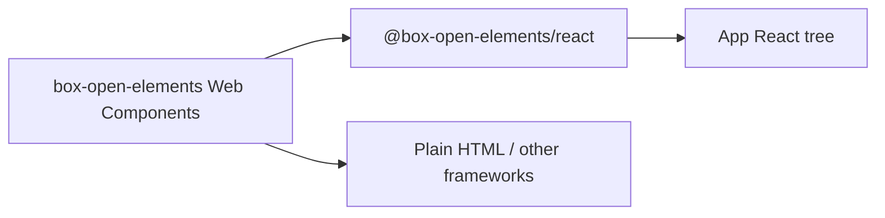

# React Adapter

Optional React wrappers for `box-open-elements` Web Components live in
[`packages/react`](../../packages/react) as `@box-open-elements/react`.
Cross-framework status and acceptance milestones live in the
[Framework Adapter Progress tracker](./framework-adapters.md).

## Goal

Keep `src/` free of React (or any UI framework). Consumers who want JSX ergonomics
can depend on the adapter package without pulling React into the core design system.



## Boundary

| Layer | Owns |
| --- | --- |
| Core (`src/`) | Custom elements, foundations, patterns — no React |
| `@box-open-elements/react` | Thin wrappers: define element, sync props as properties, forward refs/events |
| App | Tokens registration, composition, data fetching |

## Validated surface

| Export | Wraps |
| --- | --- |
| `BoxButton` | `<box-button>` |
| `BoxTextField` | `<box-text-field>` value control + typed `onValueChanged` |
| `BoxSelect` | `<box-select>` + structured `options` property + typed `onValueChanged` |
| `createWebComponent` | Shared property/event/ref adapter factory |

## Usage

```ts
import { BoxButton, BoxSelect, BoxTextField } from "@box-open-elements/react";
import {
  applyDesignTokens,
  registerBoxDefaultDesignSystem,
} from "@unofficialbox/box-open-elements/foundations/tokens";

registerBoxDefaultDesignSystem({ setActive: true });
applyDesignTokens(document.documentElement, "box-default");

<BoxButton label="Save" tone="primary" onClick={handleSave} />

<BoxTextField
  label="Project name"
  value={projectName}
  onValueChanged={event => setProjectName(event.detail.value)}
/>

<BoxSelect
  label="Status"
  value={status}
  options={[{ label: "Draft", value: "draft" }]}
  onValueChanged={event => setStatus(event.detail.value)}
/>
```

Component props map only to element **properties**, so booleans and structured
arrays do not depend on React attribute stringification. Native React handlers
remain on the host; declared custom-event props use stable DOM subscriptions
that call the latest handler. Forwarded refs resolve to the underlying custom
element.

## Non-goals (current phase)

- Wrapping the full catalog
- SSR/hydration framework kits (Next.js, Remix) beyond host hydration suppression
- Replacing headless controllers with React state libraries

## Related

- [Framework Adapter Progress](./framework-adapters.md) — canonical React, Angular, Vue, and Svelte tracker
- [Architecture](../architecture.md) — adapter packages as an optional outer layer
- [Box Server Integration](./box-server.md) — sibling optional package pattern
- Package README: [`packages/react/README.md`](../../packages/react/README.md)
