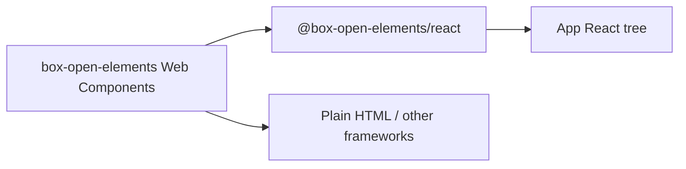

# React Adapter

Optional React wrappers for `box-open-elements` Web Components live in
[`packages/react`](../../packages/react) as `@box-open-elements/react`.

## Goal

Keep `src/` free of React (or any UI framework). Consumers who want JSX ergonomics
can depend on the adapter package without pulling React into the core design system.



## Boundary

| Layer | Owns |
| --- | --- |
| Core (`src/`) | Custom elements, foundations, patterns — no React |
| `@box-open-elements/react` | Thin wrappers: define element, sync props as properties, forward refs/events |
| App | Tokens registration, composition, data fetching |

## PoC surface

| Export | Wraps |
| --- | --- |
| `BoxButton` | `<box-button>` |
| `createWebComponent` | Shared factory for future wrappers |

## Usage

```ts
import { BoxButton } from "@box-open-elements/react";
import {
  applyDesignTokens,
  registerBoxDefaultDesignSystem,
} from "box-open-elements/foundations/tokens";

registerBoxDefaultDesignSystem({ setActive: true });
applyDesignTokens(document.documentElement, "box-default");

<BoxButton label="Save" tone="primary" onClick={handleSave} />
```

Props map to element **properties** (`label`, `tone`, `size`, `disabled`) so boolean and
enum values do not depend on React attribute stringification quirks.

## Non-goals (PoC)

- Wrapping the full catalog
- SSR/hydration framework kits (Next.js, Remix) beyond `suppressHydrationWarning` on the host
- Replacing headless controllers with React state libraries

## Related

- [Architecture](../architecture.md) — adapter packages as an optional outer layer
- [Box Server Integration](./box-server.md) — sibling optional package pattern
- Package README: [`packages/react/README.md`](../../packages/react/README.md)
