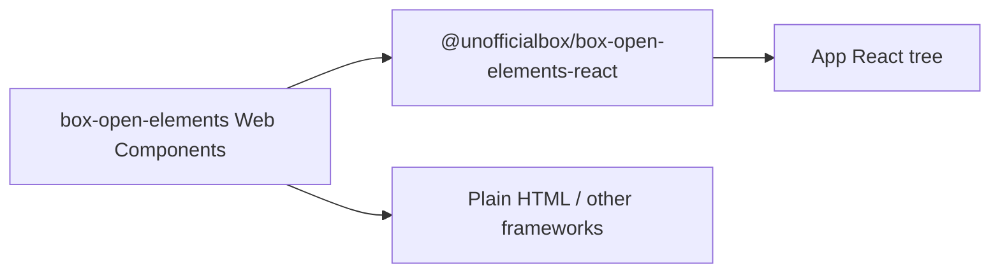

# React Adapter

Optional React wrappers for `box-open-elements` Web Components live in
[`packages/react`](../../packages/react) as
`@unofficialbox/box-open-elements-react`.
Cross-framework status and acceptance milestones live in the
[Framework Adapter Progress tracker](./framework-adapters.md).

## Goal

Keep `src/` free of React (or any UI framework). Consumers who want JSX ergonomics
can depend on the adapter package without pulling React into the core design system.


```mermaid
flowchart LR
    A["box-open-elements Web Components"] --> B["@unofficialbox/box-open-elements-react"]
    B --> C["App React tree"]
    A --> D["Plain HTML / other frameworks"]
```

## Boundary

| Layer | Owns |
| --- | --- |
| Core (`src/`) | Custom elements, foundations, patterns — no React |
| `@unofficialbox/box-open-elements-react` | Thin wrappers: import registered elements, sync props as properties, forward refs/events |
| App | Tokens registration, composition, data fetching |

## Validated surface

| Export | Wraps |
| --- | --- |
| `Button` | `<box-button>` |
| `TextField` | `<box-text-field>` value control + typed `onValueChanged` |
| `Select` | `<box-select>` + structured `options` property + typed `onValueChanged` |
| `Dialog` | `<box-dialog>` + controlled `open`, typed close events, focus/ref behavior |
| `createWebComponent` | Shared property/event/ref adapter factory |
| `useExplorerSelectionController` | React subscription to the framework-neutral selection controller |

## Usage

```ts
import { Button, Dialog, Select, TextField } from "@unofficialbox/box-open-elements-react";
import {
  applyDesignTokens,
  registerBoxDefaultDesignSystem,
} from "@unofficialbox/box-open-elements/foundations/tokens";

registerBoxDefaultDesignSystem({ setActive: true });
applyDesignTokens(document.documentElement, "box-default");

<Button label="Save" tone="primary" onClick={handleSave} />

<TextField
  label="Project name"
  value={projectName}
  onValueChanged={event => setProjectName(event.detail.value)}
/>

<Select
  label="Status"
  value={status}
  options={[{ label: "Draft", value: "draft" }]}
  onValueChanged={event => setStatus(event.detail.value)}
/>

<Dialog
  open={dialogOpen}
  heading="Delete item"
  onOpenChanged={event => setDialogOpen(event.detail.open)}
>
  This cannot be undone.
</Dialog>
```

Component props map only to element **properties**, so booleans and structured
arrays do not depend on React attribute stringification. Declared event props
use stable DOM subscriptions that call the latest handler. Forwarded refs
resolve to the underlying custom element.

### Event callbacks receive native events

Every callback prop an adapter **declares** — `onClick` on `Button`,
`onValueChanged`, `onOpenChanged`, `onConfirm`, `onCancel` — is registered with
`addEventListener` on the custom element and receives the **native** DOM event.
It is not a React `SyntheticEvent`: there is no `.nativeEvent`, and
`stopPropagation` acts on the real tree.

The reason is portability of the listener rather than purity. React delegates
from its root container, so an element that relocates itself outside that
container stops receiving delegated events — and `box-drawer` moves its whole
subtree to `document.body` when it opens. A `Button` inside an open drawer with
React's own `onClick` would look wired up and do nothing. A listener bound to
the element travels with it.

```tsx
<Button
  label="Save"
  onClick={event => {
    // event is a MouseEvent; event.currentTarget is the <box-button>
    save();
  }}
/>
```

### Delegated props still behave like React's

Anything an adapter does *not* declare is forwarded to the host element as an
ordinary React prop, including React's own `onClick` on `Select`, `TextField`
and `Dialog`. Those receive a `SyntheticEvent` and are delegated from the root
container as usual — which means they **do not fire inside an open
`box-drawer`**, because the drawer has moved the subtree out of that container.

That is React's delegation model rather than anything specific to these
components: a plain `<div onClick>` inside an open drawer is dead in exactly the
same way. If you need a click handler that survives the portal, put it on a
`Button`, or bind it yourself with `addEventListener` via a ref.


`useExplorerSelectionController(controller)` uses React's external-store
contract to render the controller snapshot. Selection rules and mutations stay
inside `ExplorerSelectionController`; the hook does not create a second state
machine.

## SSR and hydration

The adapter and component modules are safe to import without `HTMLElement` or
`customElements`. Server rendering emits inert `box-*` hosts and slotted
content. Property synchronization, event subscriptions, and custom-element
upgrade happen in the browser; `suppressHydrationWarning` is scoped to each
adapter host for expected custom-element differences.

In SSR frameworks, import or initialize design tokens in client code because
token application requires a document.

The production Next.js fixture at
[`examples/frameworks/react-ssr`](../../examples/frameworks/react-ssr)
prerenders the adapter hosts, then proves browser upgrade and hydration without
console errors. It also exercises events, controller state, dialog focus, and
focus restoration after Escape.

## Supported versions

| Dependency | Supported contract |
| --- | --- |
| React / React DOM | `^19.0.0` |
| `@unofficialbox/box-open-elements` | `^0.7.0` |
| Node.js for SSR | `>=20.9.0` |
| Next.js validated host | `16.2.12` |

## Non-goals (current phase)

- Wrapping the full catalog
- Framework-specific helpers beyond the validated Next.js host contract
- Replacing headless controllers with React state libraries

## Related

- [Framework Adapter Progress](./framework-adapters.md) — canonical React, Angular, Vue, and Svelte tracker
- [Architecture](../architecture.md) — adapter packages as an optional outer layer
- [Box Server Integration](./box-server.md) — sibling optional package pattern
- Package README: [`packages/react/README.md`](../../packages/react/README.md)
