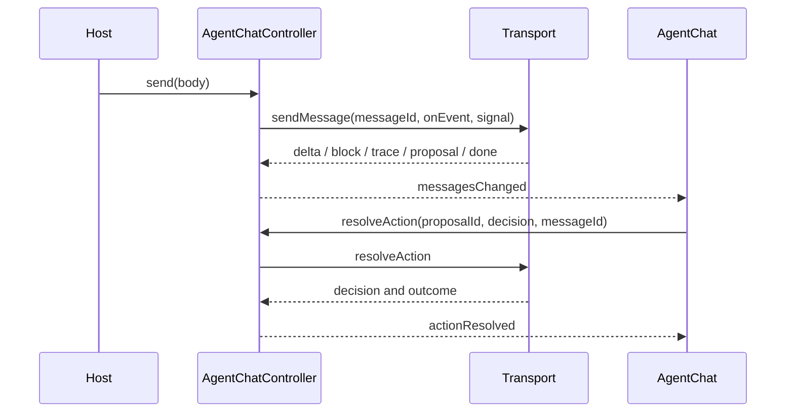

# Agent UI building blocks

All new surfaces use the existing import contract: concise root exports or
individual entrypoints such as `@unofficialbox/box-open-elements/run-summary`.
The four framework packages remain thin optional adapters; the new elements
can be used directly or composed from their headless contracts.

## Status and results

`foundations/status` exports `toStatusKind`, `statusLabel`, `boeStatusGlyph` and
`boeStatusStyles`. `StatusIcon` renders a decorative 16px circle plus a hidden
label. Use the same vocabulary for trace, todo, verdict and approval states.

`approved` and `rejected` retain their own labels and neutral, outlined glyphs;
they never map to `done` or `skipped`. An approved action can still fail during
execution. Keep the decision and execution outcome separate.

Error Toasts remain visible until explicitly dismissed or replaced, even when
the caller supplies a timeout. Non-error Toasts can expire; `duration="0"` and
`mode="sticky"` prevent expiry. Recovery guidance belongs inline as well, not
only in a dismissible notification.

`ResultBlock` is a serializable union of `facts`, `checks`, `table` and
`documents`. `ResultBlocks.blocks` renders any sequence, using an optional
block `id` for stream updates. `FactList.rows`, `CheckList.rows`, and
`DocumentList.items` offer the standalone forms. Tables scroll within a
focusable region; the final subject column is emphasized. Document rows emit
`document-selected` with `{ id }`; safe URLs open in a new tab.
`resultDocumentIds(blocks)` and `ResultBlocks.documentIds` support citation
deduplication. Never place tokens or private URLs in a public demo.

## Run summary

```ts
import { RunSummary } from "@unofficialbox/box-open-elements/run-summary";
const summary = new RunSummary();
summary.turn = {
  startedAt: Date.now(), steps: [],
  todos: [{ id: "extract", content: "Extract terms with Box AI", status: "in_progress" }],
};
document.body.append(summary);
```

`turn` contains `steps`, `todos`, `startedAt` and optional `endedAt`/`incomplete`.
Set `failed` for a failed turn. `open` defaults to false; `elapsed-threshold`
defaults to 2000ms. The live status label excludes the ticking clock.
`progress`, `formatElapsed` and `splitStepTitle` are pure helpers exported from
`patterns/run`. Timers stop on completion and disconnect.

## Chat stream contract

`AgentSendRequest.messageId` identifies the reply receiving callbacks. IDs are
unique within a controller; use a conversation ID as well across controllers.
`AgentStreamEvent` retains `delta`, `citation`, and `proposal`, and adds:

| kind | Payload | Message field |
| --- | --- | --- |
| `block` | `block: ResultBlock` | `blocks` (same optional ID replaces) |
| `trace` | `step: RunStep` | `trace` (same ID replaces) |
| `todos` | `todos: AgentTodo[]` | `todos` (snapshot) |
| `options` | `options: {label, prompt}[]` | `options` (snapshot) |
| `context` | `context: Record<string, unknown>` | `context` |
| `done` | `status: complete / needs_input / error` | `completeness` |

Optional `seq` starts at 1. Duplicate sequence numbers are ignored. Missing
numbers or a missing `done` produce `completeness.status = "incomplete"` and
`missing[]`. Old transports still finish normally but now show an honest
incompleteness notice until they emit `done`. Messages also carry numeric
`startedAt`/`endedAt` timestamps in milliseconds. `readNdjson(stream)` handles
chunked UTF-8 and CRLF, rejects invalid JSON or oversized lines, and releases
its reader on completion, error, cancellation, or an early iterator return.

`AgentActionProposal.outcome` is `done` or `failed`, separate from `decision`.
The controller exposes `resolving` while awaiting a decision and suppresses
duplicate submissions. Failed approved actions render an alert and a retry of
the originating request; success suggestions are suppressed. Supply
`resolveAction(id, decision, note?, messageId?)` when proposal IDs repeat across
turns. `AgentChat.focusProposal(messageId, proposalId)` provides a scoped
anchor; `focusComposer()` uses `preventScroll`.

`ScrollPinController` is reusable for live lists. Call `connect(content)` with
an inner content element for resize observation, `contentChanged(true)` for a
new message, and `disconnect()` on teardown. Upward wheel/touch/keyboard or
scrollbar motion unpins; passive scroll events do not. `jump()` re-pins and
honours reduced motion.

## Workspace

`AgentWorkspaceController(createSession)` owns independent chat controllers.
`newChat()` reuses an untouched chat, `select(id)` keeps other sessions alive,
and `destroy()` tears down owned controllers. `summaries` exposes word-cut
titles and waiting/working status. `details` exposes context, approvals with
message IDs, and deduplicated sources in first-seen order.

Assign it to `AgentWorkspace.workspaceController`. `chats`, `conversation`,
and `details` slots allow host compositions. Default conversations remain
mounted while hidden, preserving their controllers and scroll positions.
At widths below 900px, side panes become mutually exclusive drawers. At wide
widths, `viewer-key` scopes persisted pane preferences; details starts open at
1200px. Storage failures fall back to in-memory defaults.

The docs and workshop share five simulated scenarios: Overview, Streaming,
Approval, Failure and Empty. Run scenario streams a delayed response; switching
conversations does not interrupt it. Approval deliberately demonstrates an
approved action that fails execution, while rejection makes no change. Sources
have no live file links. No provider requests or writes occur.

Use **Expand workspace** for the full three-pane layout (at least 1200px wide);
the normal docs column demonstrates drawers. Escape or Exit expanded view
returns to the page. Fullscreen availability depends on the browser. The demo
returns a teardown callback that detaches the host, aborts pending streams and
destroys every owned session on navigation or variant changes. The Code tab
shows the same ownership pattern for a host-supplied transport and token.

## Developer call console

Place `CallConsole` on a separate developer page. Assign a
`CallConsoleController(transport)` and call `connect()`. The optional
`createCallConsoleTransport("/calls")` adapter uses:

- `GET /calls`: `CallEntry[]` snapshot.
- `GET /calls/stream`: SSE named `snapshot`, `call`, `clear`; each data payload
  is a matching `CallEvent` object. Same IDs replace pending entries.
- `DELETE /calls`: clear, returning 204.

The console filters by service/errors, distinguishes `rpcError` from HTTP
success, provides a keyboard-resizable split view, and copies HTTP text with a
textarea fallback. Hosts own controller connection lifetimes.

Search matches method, URL, summary and service. Arrow Up/Down and Home/End
select requests while focus is in the list; Tab reaches filters and copy
controls. The panes stack at container widths below 640px. Empty, filtered-empty,
connecting, reconnecting and unavailable states are explicit; Reconnect retries
the controller. Failed clear requests retain the existing calls and report an
error. Copy controls are unavailable without a selected request.

Events: `call-selected` carries only `{ id }`; `filters-changed` carries
`{ service, errorsOnly, query }`; `calls-cleared` follows a successful clear.
Section copies emit the shared `code-copied` event. Selection events deliberately
exclude headers and bodies. Requests must already be redacted by the server;
this inspector is not an authorization boundary.

The docs/workshop demo is labeled simulated. It includes successful Box calls,
a failed tool under HTTP 200, an HTTP 403, an expected MCP 405 and a pending
request. Simulate request inserts and settles a request; Reset demo restores
the fixtures. Variants cover empty and connection states. No demo requests go
to a real provider, and teardown cancels the simulated stream.

The private server package exports `CallLog`, `loggedFetch`, redaction helpers
and `createCallLogHandler(log, authorize)`. Mount only behind developer access
control. Authorization and cookies, token/secret JSON fields, OAuth codes and
URL credentials are redacted before log emission. Unknown text bodies are
omitted; capture is bounded to 1MiB. GET event streams are not consumed.
Pass `{mcp: true}` as the fourth `loggedFetch` argument to classify GET/DELETE
405 responses as expected. Generic HTTP 405 responses remain failures.
JSON-RPC errors and `isError: true` tool results count as failures even on 2xx.


