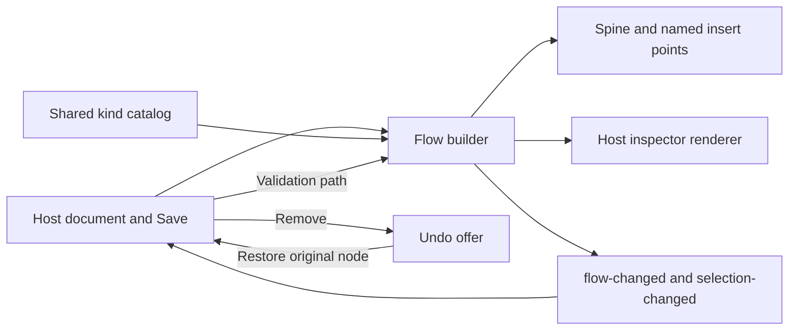

# Builder and editor guidelines

Use these rules for workflow builders, plan editors, configuration screens and other surfaces where people create a document that a runtime later executes. Pair them with [agent UI guidelines](./agent-ui-guidelines.md) when an agent can propose or run work.

## Principles

1. **Describe what will run.** Use plain names and one sentence about runtime behavior. Keep enum values, internal paths and protocol terms in developer tools. If a preview disagrees with execution, repair the preview.
2. **Make structure visible.** Show a vertical sequence with starts, ends and named insertion points. Put related fields in a card or inspector. Use a table for repeated records so column headings replace repeated labels.
3. **Keep state honest.** Show unsaved changes until Save succeeds. Persist validation near the offending field and mark the matching step. A failed Save remains visible; do not let a brief toast be the only record of failure.
4. **Make removal reversible.** Remove immediately, then offer Undo for eight seconds. Keep the offer available while hovered or focused. Command/Control-Z restores it unless focus is inside an editor.
5. **Give each action one clear place.** One primary action per view. The same step catalog drives the inline palette and the insertion menu. Avoid confirmation dialogs for reversible local edits.
6. **Use the design system contract.** Tokens and public parts define color, type, states and focus. A reusable pattern owns accessible interaction; the host owns document schema, validation, persistence and domain fields.

## Anti-patterns and replacements

| Avoid | Use |
| --- | --- |
| Raw enum names such as `fail_fast` or `join_all` | “Stops the remaining branches when one fails” |
| A card titled “Parallel” followed by a “Parallel” subtitle | Show the kind only when the card has a distinct name |
| Every insert button named “Add step” | “Insert between Read contract and Save results in Contract branch” |
| Repeated “Name / Value” labels in every row | A table with one set of column headings |
| A disappearing error toast for a failed Save | Persistent error by Save and a marked step/field |
| A mobile editor sheet opening automatically over a validation error | Mark the step and keep the error visible; open the sheet on deliberate selection |
| Fake code or placeholder data in an empty state | Explain what will appear and give one action to create it |
| Two adjacent primary buttons | One primary Save; other actions neutral |
| Decorative Unicode characters as icons | Catalog glyphs or labeled words |
| A confirmation modal before each local removal | An Undo action with a visible time window |

## Flow builder contract

`box-flow-builder` accepts a mutable `FlowNode[]`, a catalog of types, and an optional inspector renderer. It emits `flow-changed` when it inserts a node and `selection-changed` when selection changes. The host calls `refresh()` after its own edits and `setValidation(message, path, document)` after validation. The library maps the path to the deepest matching node and marks it; the host remains the source of truth for validation and saving.

The pattern includes `box-flow-spine`, `box-flow-card`, `box-insert-point`, and `box-kind-picker` for custom compositions. The chooser supports arrow keys, Home, End, Escape and focus return. Cards use native buttons and expose selection through `aria-pressed`. On narrow screens, deliberate selection opens an inspector in `box-drawer` as a bottom sheet. Closing the sheet deselects the node. An insertion focuses its new card, including on mobile.

For validation, a path such as `['body', 1, 'branches', 0, 'body', 2, 'endpoint']` points at the deepest step on that path. A path ending in a field still marks that step. The builder does not assume a host schema beyond object traversal and a step's `kind`.

## Pre-ship checklist

- [ ] Copy uses plain language and describes actual runtime behavior.
- [ ] The preview includes empty, unsaved, saved, invalid and failed-save states.
- [ ] Every insertion point has a distinct location name; every card has a unique, meaningful accessible name.
- [ ] Keyboard insertion, selection, Escape, focus return and Undo work without a mouse.
- [ ] Removal restores the same object after intervening edits and never overwrites a recreated key.
- [ ] The Undo offer pauses while hovered or focused; errors stay until resolved.
- [ ] At desktop and 390px, validation remains visible and the page has no horizontal overflow.
- [ ] Light, dark and reduced-motion views use public tokens and parts.
- [ ] A screen reader hears success, failure and restoration once through the persistent announcer.

See [Flow builder and undo](./flow-builder.md) for integration examples.
