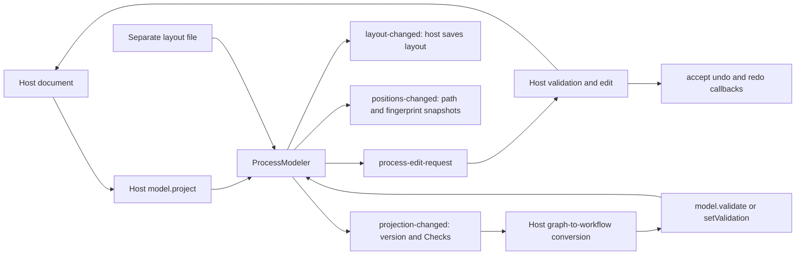

# Process modeler

`box-process-modeler` projects host documents as boxes, frames and connections.
It does not translate diagrams to workflows or save them. The host owns those
rules and can refuse unsupported shapes before changing its document.



```ts
import { ProcessModeler } from "@unofficialbox/box-open-elements/patterns/process-modeler";
const canvas = document.querySelector("box-process-modeler") as ProcessModeler;
canvas.model = { project: doc => ({ boxes: doc.boxes, lines: doc.lines }) };
canvas.document = document;
canvas.layout = { boxes: { first: { x: 40, y: 40 } } };
canvas.addEventListener("process-edit-request", event => {
  // Validate event.detail, then apply it to your document.
  // Refusal: leave the document unchanged and show setValidation([...]).
  // Acceptance: event.detail.accept({ undo: restoreBefore, redo: applyAfter });
  // Call canvas.refresh() after mutations; assigning document also refreshes.
});
canvas.addEventListener("layout-changed", event => saveLayout(event.detail.layout));
```

## Contract

- `ProcessModel.project(document)` returns boxes with stable IDs, host node
  references, kind/title, optional path and frame/parent IDs; lines have unique
  IDs, existing endpoints, optional labels, dashed style and authored points.
- `ProcessModel.arrange(projection)` optionally supplies the host's layout for
  Tidy up and missing positions. Existing authored positions win on refresh;
  Tidy up intentionally recomputes them. Without a hook, `arrangeProcess` lays
  out connected steps left to right, branches vertically, and sizes nested
  frames around their children. Cycles remain visible and appear in Checks.
- `layout` is copied on assignment/read. It preserves positions/sizes, notes,
  sections and line control points separately from workflow data. Missing box
  positions receive a deterministic fallback. `load(document, options)` accepts
  saved positions keyed by `JSON.stringify(path)` or position snapshots; only
  matching paths and explicit matching fingerprints are restored.
- `catalog` uses `FlowKind` entries. The grouped searchable palette supports
  keyboard add or drag/drop. Add/delete/connect/disconnect/insert/reparent requests are
  delivered as `process-edit-request`; no document mutation happens implicitly.
  The host supplies reversible callbacks via `accept()` after applying an edit.
  Accepted adds use the requested drop position; document callbacks and the
  corresponding canvas layout restore together as one undoable edit.
  Pass `accept({ undo, redo, layout })` to atomically retain the edit's new
  positions without clearing earlier history; accepted host layout takes priority
  over a requested position. Existing-box insert/reparent positions are retained
  atomically too. Palette clicks omit position;
  drops include one. Line insert opens the grouped kind chooser when a catalog
  exists and includes the chosen `kind` in the request.
- `move-request` is cancelable. Accepted moves and Tidy up emit `layout-changed`
  and join the same bounded history as host-accepted edits. `undo()` and `redo()`
  replay callbacks. Different external layout replacements clear history;
  controlled echoes and layout assignments inside undo/redo preserve it.
  Hosts can supply a shared `ProcessHistory` through `history`, and pass
  `() => canvas.undo()` to `patterns/undo`'s `offerUndo` for an adjacent undo
  offer. The canvas prevents duplicate keyboard handling through preventDefault.
- `resize(id, width, height)`, `routeLine(id, points)`, `setNote(note, id)` and
  `setSection(section, id)` share that history. Pass null to remove a note or
  section. These APIs let host inspector controls edit layout without replacing
  history. Tidy positions nested frame contents together; moving a frame moves
  all descendants in one undoable operation.
- `renderInspector(node, container)` may return cleanup. `setValidation(checks)`
  marks boxes by ID or path and adds selectable, announced Checks.
- `locked` blocks edits but retains navigation. `snap-to-grid` uses 20px units.
  `--boe-process-height` sets canvas height (default 560px).
- `heading-level` sets the inspector heading (1-6, default 2).
  `--boe-process-inspector-width` and `--boe-process-inspector-min-width` default
  to 280px and 220px. The searchable palette is on the left; the inspector is on
  the right with Outline, Checks, Variables, Connections and Shortcuts tabs.
  Below 1,000px component width, both panes use named modal drawers. `narrow`
  exposes that state. Outline buttons have at least 28px targets.
  `disable-connections` removes disconnect controls and refuses connect and
  disconnect requests. Unlabelled lines have no placeholder label; line actions
  appear on hover or keyboard focus.

## Interaction

Select boxes with pointer or Tab/Enter. Arrow keys move the selected box; Shift
moves further. C followed by another box connects them; Escape cancels. Delete
requests removal. Connection insert/remove buttons have spoken endpoint labels.
Connect selected and Delete selected also expose those operations as buttons.
Command/Control-Z and Shift-Z undo/redo only when the local history can handle
them; empty or locked history leaves the key for the host. Background drag and trackpad scroll pan;
Control-wheel and two-pointer pinch zoom. Zoom buttons, 100% reset, Fit and a
click-to-jump overview provide alternatives. The overview is keyboard reachable:
arrow keys pan and Enter fits. Layout movement
has no animations and respects reduced-motion users. Light and dark consume the
same foundation tokens.

Frames are projected boxes drawn behind their children; the host owns grouping
and semantic legality. Notes/sections and hand-adjusted lines are supplied as
layout data, not workflow fields. The library does not enforce any particular
workflow's save rules. Generic Checks identify loops, ordinary steps with
multiple destinations, branch paths that do not meet, and Parallel paths without
a join. `model.validate(document, projection)` supplements these with the host's
own vocabulary and conversion rules. Checks link back to a box or host path.

## Prototype Controls

- Hover or select a step to reveal four ports. Drag a port to another step to
  request a connection; click or keyboard-activate it to choose a new step in
  that direction. Requests carry `fromSide`; lines can also supply `toSide`.
- Drop a building block or existing step onto a highlighted line to insert it.
  Drop into a frame to request grouping. These requests remain host-owned and
  may be refused; a refused drag returns to its original position.
- Automatic routes are orthogonal and avoid boxes. Authored interior points
  remain part of layout, not the workflow document. Drag an interior segment or
  focus its Route button and use arrow keys to adjust it. Blocked routes appear
  in Checks rather than drawing through an overlapping step.
- Decision lines default to Yes/No/Route labels; explicit labels always win.
  Weighted lines may supply `weight`; dashed Try failures default to If it fails.
- Shift-click steps or Shift-drag empty canvas for multiple selection. Use the
  floating toolbar to align tops, space horizontal positions, or delete selected
  steps. Dragging selected steps moves the group, including frame descendants.
  Alignment guides and spacing labels appear during movement; snap uses 20px.
- Boxes are focusable groups with `aria-current`, not `aria-selected`. Enter or
  Space selects them. Ports keep 24px targets when the canvas is zoomed out.

## Host Bridge

```ts
canvas.load(workflow, {
  version: 12,
  positions: savedPositions,
  selectedPath: ["steps", 0],
});
canvas.connections = [{ name: "Production Box", kind: "OAuth", id: "box-prod" }];
canvas.variables = [{ name: "fileId", description: "Input file" }];
canvas.selectedPath = ["steps", 1, "parameters"]; // deepest projected box
canvas.selectMany(["read", "save"]);
canvas.addEventListener("positions-changed", event => savePositions(event.detail.positions));
canvas.addEventListener("projection-changed", event => {
  // Convert event.detail.projection using your own schema. Invalid graphs can
  // remain on the canvas while Checks explain why they cannot yet be saved.
  convertGraph(event.detail.projection, event.detail.version);
});
canvas.addEventListener("selection-changed", event => selectHostPath(event.detail.path));
```

`ProcessBox.path` and `fingerprint` are supplied by the host. Position snapshots
are detached and sorted by ID, and include path/fingerprint when provided.
Selection events include `box`, `boxes`, and a detached `path`; `selectedPath`
normalizes field paths to their deepest projected box. `projection-changed`
fires once for each changed projection, with its version and current checks;
refreshing an unchanged projection does not create another version. Connections
and variables are displayed as host-supplied information, not credentials.
