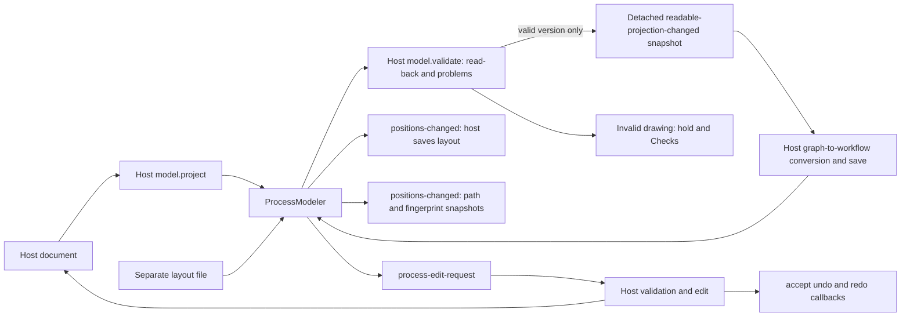

# Process modeler

`box-process-modeler` is the reusable canvas, palette and details panel for the
Riptide Diagram design. It projects a host document as boxes and connections,
but does not translate drawings into workflows or save them. Riptide or another
host owns its schema, read-back conversion, persistence and save policy.



```ts
import { ProcessModeler } from "@unofficialbox/box-open-elements/patterns/process-modeler";
const canvas = document.querySelector("box-process-modeler") as ProcessModeler;
canvas.model = {
  project: doc => ({ boxes: doc.boxes, lines: doc.lines }),
  validate: (doc, projection) => readBackProblems(doc, projection),
};
canvas.load(document, { version: 12, positions: savedPositions });
canvas.catalog = hostCatalog; // Reuse the same kind list as Flow Builder.
canvas.outline = hostOutline;
canvas.fields = hostFieldsByBoxId;
canvas.lastRun = hostRunMetrics;
canvas.addEventListener("process-edit-request", event => {
  // The host applies or refuses the edit; it owns undo/redo of the document.
  // On acceptance, assign the new document and call:
  // event.detail.accept({ undo: restoreBefore, redo: applyAfter });
});
canvas.addEventListener("positions-changed", event => savePositions(event.detail.positions));
canvas.addEventListener("readable-projection-changed", event => {
  // Only valid versions arrive here. Convert with your own workflow schema.
  keepLastReadableWorkflow(convertGraph(event.detail.projection));
});
```

## Contract

- `ProcessModel.project(document)` returns boxes with stable IDs, host node
  references, kind/title, optional path and frame/parent IDs; lines have unique
  IDs, existing endpoints, optional labels, dashed style and authored points.
- `ProcessModel.arrange(projection)` optionally supplies the host's layout for
  Tidy up and missing positions. Existing authored positions win on refresh;
  Tidy up intentionally recomputes them. Without a hook, `arrangeProcess` lays
  out connected steps left to right, branches vertically, and sizes nested
  frames around their children. Cycles remain visible and appear in Checks.
- `layout` is copied on assignment/read. It preserves positions/sizes, notes,
  sections and line control points separately from workflow data. Missing box
  positions receive a deterministic fallback. `load(document, options)` accepts
  saved positions keyed by `JSON.stringify(path)` or position snapshots; only
  matching paths and explicit matching fingerprints are restored.
- `catalog` uses `ProcessKind` entries shared with Flow Builder, with optional
  search aliases and visual shapes. The grouped palette supports keyboard add
  or drag/drop. Add/delete/duplicate/connect/disconnect/reattach/insert/reparent requests are
  delivered as `process-edit-request`; no document mutation happens implicitly.
  The host supplies reversible callbacks via `accept()` after applying an edit.
  Accepted adds use the requested drop position; document callbacks and the
  corresponding canvas layout restore together as one undoable edit.
  Pass `accept({ undo, redo, layout })` to atomically retain the edit's new
  positions without clearing earlier history; accepted host layout takes priority
  over a requested position. Existing-box insert/reparent positions are retained
  atomically too. Palette clicks omit position;
  drops include one. Line insert opens the grouped kind chooser when a catalog
  exists and includes the chosen `kind` in the request.
- `move-request` is cancelable. Accepted moves and Tidy up emit `layout-changed`
  and join the same bounded history as host-accepted edits. `undo()` and `redo()`
  replay callbacks. Different external layout replacements clear history;
  controlled echoes and layout assignments inside undo/redo preserve it.
  Hosts can supply a shared `ProcessHistory` through `history`, and pass
  `() => canvas.undo()` to `patterns/undo`'s `offerUndo` for an adjacent undo
  offer. The canvas prevents duplicate keyboard handling through preventDefault.
- `resize(id, width, height)`, `routeLine(id, points)`, `setNote(note, id)` and
  `setSection(section, id)` share that history. Pass null to remove a note or
  section. These APIs let host inspector controls edit layout without replacing
  history. Tidy positions nested frame contents together; moving a frame moves
  all descendants in one undoable operation.
- `outline` supplies nested, plain-language steps. `fields` supplies controlled
  field descriptors keyed by box ID: text, multiline, number, choice, boolean,
  search, grouped action typeahead and expression. Action options carry the
  host's value, display label and optional group; the component supports both
  browse-by-group and global search. The component draws controls and emits
  `process-field-change-request`; the host validates and updates its document.
  `renderInspector(node, container)` remains available for specialized fields
  such as a host-specific Box action browser and may return cleanup.
- `setValidation(checks)`
  marks boxes by ID or path and adds selectable, announced Checks.
  `model.validate` is authoritative when supplied: its results replace generic
  vocabulary-based graph checks rather than being added to them. This lets a
  host with kinds such as `if`, `switch` and `try` own read-back semantics
  without false positives. The exported `graphChecks` remains available if a
  host wants to compose generic checks into its own validator.
- `readback` gives `{ current, lastReadable, checks, version }`. `current` is
  null before a document loads or while Checks are present; `lastReadable`
  stays available to the host during a hold. No projection or readable event
  fires for the unloaded empty component.
  A hold banner in its own row above the canvas links to Checks without
  covering steps that need repair. The diagram keeps the remaining canvas
  height whether that banner is hidden, visible, or dismissed after repair.
  `readable-projection-changed`
  only emits a version when it passes validation. A new document assignment
  emits a new readable version even when its visible labels are unchanged;
  refreshes of the same document do not. The event and `readback` detach box,
  path, line and route presentation data so listeners cannot corrupt the
  retained readable graph. Generic `box.node` payloads remain host-owned
  references; use immutable host documents or call `load` for a new version.
- `locked` blocks edits but retains navigation. `snap-to-grid` uses 16px units.
  Zoom is bounded to 25–200%; `setView({ x, y, zoom })` restores an authored
  viewport. **Tidy up** reflows the graph and keeps at least 70% zoom on wide
  layouts or 55% on narrow layouts, starting at the beginning when the entire
  graph cannot fit legibly. **Fit the whole process** can still zoom to 25%.
  The 16px dot grid follows zoom and pan; below 50% zoom it shows
  every fourth grid point to stay legible. `--boe-process-height` sets canvas
  height (default 660px).
- `heading-level` sets the inspector heading (1-6, default 2).
  `embed-mode` hides duplicate view/last-run controls at desktop and phone
  widths when the host supplies them. The inspector keeps its process/selection
  heading, as in Riptide's embedded Diagram; the canvas, checks and editing remain.
  See the [Process Modeler handoff](process-modeler-handoff.md) for issue status
  and the host-adoption acceptance matrix.
  The palette is 248px on the left; the inspector is 320px on the right, with
  Outline, Checks, Variables, Connections and Shortcuts tabs. Below 900px
  component width, both panes use named drawers with a local scrim, bounded by
  the component rather than the viewport. `narrow` exposes that state.
  Closed drawers are inert; Escape, the close button, or the scrim closes an
  open drawer and returns focus to its trigger. The desktop palette has a
  visible "Add to the process" heading; the
  mobile drawer supplies that heading in its title instead. Outline links
  have at least 24px targets. The mobile building-block
  drawer is named "Add to the process" and focuses search when opened.
  At phone width, Add comes first in the bar; Tidy and undo/redo buttons are
  hidden to preserve space, while keyboard history remains available.
  `disable-connections` removes disconnect controls and refuses connect and
  disconnect requests. Unlabelled lines have no placeholder label; line actions
  appear on hover or keyboard focus.

## Interaction

Tab reaches boxes. Alt+arrows chooses the nearest box in that direction;
arrows nudge a selected box by 16px, Shift+arrows by 64px. N opens a
non-modal, searchable chooser beside the selected box. It names the insertion
point and, for a simple box with one outgoing line, requests an insert on
that line; Escape returns focus to the box. Ctrl+Alt+arrows opens the same
contextual chooser at a directional port; east inserts on a sole outgoing line,
while other directions add a connected step. Enter focuses the selected step's editor, Delete removes, and Shift+1
fits the whole process. Ctrl/Command+A selects all; C/V/D copy, paste and
duplicate host-owned boxes. Ctrl/Command+Z and Shift+Ctrl/Command+Z undo and
redo only when local history can handle them; empty or locked history leaves
the key for the host. Escape closes an open View menu or cancels a connection
or reattachment. An idle Escape does not announce a cancelled connection.

Background drag, Space-drag over a step, and trackpad scroll pan; Control-wheel and two-pointer pinch
zoom. The floating controls offer zoom, 100% reset, fit, snap and lock. The
208×136 overview is keyboard reachable: arrows pan and Enter fits. The
floating toolbar changes for one box, multiple boxes or one line. Selected
line endpoints can be dragged or keyboard-activated for reattachment; a hand-
routed line can be reset. Motion respects `prefers-reduced-motion`, and light
and dark consume the same foundation tokens.

Frames are projected boxes drawn behind their children; the host owns grouping
and semantic legality. Notes/sections and hand-adjusted lines are supplied as
layout data, not workflow fields. The library does not enforce any particular
workflow's save rules. When `model.validate(document, projection)` is supplied,
its read-back checks replace generic vocabulary checks. This is essential when
a host uses its own names for decisions, parallel branches or failure paths.
The exported `graphChecks` is opt-in. Checks link back to a box or host path;
the host retains its last valid workflow while the drawing is being repaired.
The empty Checks pane says “Ready to run”; selecting a problem announces its
message assertively while routine navigation stays polite.
The desktop bar mirrors the reference order: Business/Technical view, a
visual Last run switch when metrics exist, Checks status, Undo, Redo, then
Tidy up. The status opens the Checks tab and reads “Ready to run” or the
problem count. On narrow screens, view and Checks actions live in the View
menu; the host may hide duplicate view/last-run controls with `embed-mode`.
Select a frame to reveal its resize handle; drag it or use its arrow keys to
change size in 16px increments. Set `loopMark` on repeating frames; the library
does not guess loop semantics from a host kind. Resizing is part of local undo
history. Tidy animates box positions over 320ms unless reduced motion is set.

## Canvas controls

- Hover or select a step to reveal four ports. Drag a port to another step to
  request a connection; the target outlines and a tooltip explains whether it
  can attach. Drop on empty canvas to choose a connected step at that position;
  cancellation makes no edit. Click or keyboard-activate a port to choose a step
  in that direction. The east port, like **Add next**, inserts between the
  source and its sole successor. These entry points open a contextual chooser
  beside the port, toolbar action, or drop point. Requests
  carry `fromSide` and, for an empty drop, `position` and `parentId`; lines
  can also supply `toSide`, and authored sides show pinned-end marks. Dropping
  on the highlighted edge point requests `toSide` (or `fromSide` during
  reattachment); dropping elsewhere on a box leaves that end automatic.
- Drop a building block or existing step onto a highlighted line to insert it.
  Activating a line's insert button or the selected-line toolbar opens the
  contextual kind chooser at the line midpoint; Escape cancels without an edit
  and returns focus to the invoking button. Unlabelled connections retain an
  invisible 24px screen-space midpoint target so pointer users can reveal
  these actions even when the canvas is zoomed out.
  On an accepted new-step insert along a straight, root-level row, the library
  makes room by moving that row's later columns and records the layout with the
  host edit for undo/redo. Branched and nested inserts retain host-owned layout
  placement. A placement ghost follows a palette drag. Drop into a frame to request
  grouping. These requests remain host-owned and
  may be refused; a refused drag returns to its original position.
- Catalog entries marked `placement: "note"` or `"section"` create reader-only
  layout annotations locally, not workflow boxes. The same grouped catalog
  powers both this palette and the flow builder; add/insert choosers exclude
  annotations that cannot form connected steps.
- Automatic routes are orthogonal and avoid boxes. Authored interior points
  remain part of layout, not the workflow document. Drag an interior segment or
  focus its Route button and use arrow keys to adjust it. Blocked routes appear
  in Checks rather than drawing through an overlapping step.
- Decision lines default to Yes/No/Route labels; explicit labels always win.
  Weighted lines may supply `weight`; dashed Try failures default to If it fails.
- A Try frame without a failure route offers **If it fails** from its selection
  toolbar. Its add request carries `routeLabel` and `dashed`; the host maps
  those to its workflow semantics. After that route exists, the action becomes
  **Add next**.
- Shift-click steps or Shift-drag empty canvas for multiple selection. Use the
  floating toolbar to line up, tidy or delete selected steps. "Tidy these"
  arranges the selected connected steps left to right without moving unrelated
  boxes; a selected frame carries and arranges its descendants. Dragging
  selected steps moves the group, including frame descendants.
  Alignment guides and spacing labels appear during movement; snap uses 16px.
- Boxes are focusable groups with `aria-current`, not `aria-selected`. Enter or
  Space selects them. Ports keep 24px targets when the canvas is zoomed out.

## Host Bridge

```ts
canvas.load(workflow, {
  version: 12,
  positions: savedPositions,
  selectedPath: ["steps", 0],
});
canvas.connections = [{ name: "Production Box", kind: "OAuth", id: "box-prod" }];
canvas.variables = [{ name: "fileId", scope: "process", startingValue: "input.fileId" }];
canvas.processTitle = "Upload round trip";
canvas.processSummary = "8 steps in 3 sections";
canvas.lastRun = { label: "Run 27", steps: { upload: { callsPerSecond: 12, p95Ms: 412 } } };
canvas.selectedPath = ["steps", 1, "parameters"]; // deepest projected box
canvas.selectMany(["read", "save"]);
canvas.addEventListener("positions-changed", event => savePositions(event.detail.positions));
canvas.addEventListener("readable-projection-changed", event => {
  // Convert only graphs that passed model.validate.
  convertGraph(event.detail.projection, event.detail.version);
});
canvas.addEventListener("process-field-change-request", event => updateHostField(event.detail));
canvas.addEventListener("process-variable-change-request", event => updateHostVariable(event.detail));
canvas.addEventListener("connection-setup-request", () => openHostConnections());
canvas.addEventListener("selection-changed", event => selectHostPath(event.detail.path));
```

`lastRun.steps` is keyed by projected box ID. When Last run is shown, a task
missing from that map says “Not in the last run”; events and gateways do not
show step metrics. Measured tasks show rate, p95 duration, and failed share on
the canvas, with the run label and full table in the inspector. A line with a
host-supplied `share` shows its traffic percentage beside the connection label
and scales the line width while Last run is on.

`ProcessBox.path` and `fingerprint` are supplied by the host. Position snapshots
are detached and sorted by ID, and include path/fingerprint when provided.
Selection events include `box`, `boxes`, and a detached `path`; `selectedPath`
normalizes field paths to their deepest projected box. Setting `selectedPath`
from the host updates the selection without echoing `selection-changed`;
user-initiated selection still emits it. `projection-changed`
fires once for each changed projection, with its version and current checks;
refreshing an unchanged projection does not create another version. The separate
`readable-projection-changed` event fires only for a version with no checks, so
the host can use its own `model.validate` conversion gate to keep the last
valid workflow while the drawing is being repaired. `projection-changed` remains
the raw diagnostic event, including invalid versions. Connections are
host-supplied display data, never credentials; the library requests the host's
connection setup instead of storing secrets. Variables and kind fields emit
controlled edit requests. The reference Riptide Diagram remains the visual
specification at 1440px and 390px in both themes.


### Host-owned variable editing

`variablesEditable = true` opts into Name, Scope, Add and Remove controls in the
Variables pane. It defaults to false, preserving existing display behavior.
The component emits `process-variable-edit-request` with `ProcessVariableEdit`:
`{type: "add"}`, `{type: "remove", name}`, `{type: "rename", name, value}`, or
`{type: "scope", name, value: "iteration" | "process"}`. The host applies or
refuses the request and echoes its `variables` array; the component never mutates
that array. Starting expressions retain the existing
`process-variable-change-request` contract. Supply `problem` for host validation.
Locked diagrams disable all variable editing controls.

Host checks can supply an optional `title` for a short problem summary. `message` remains the explanatory detail and live announcement. Titled Checks cards show the affected step, title and detail; the canvas shows the concise title. Existing message-only checks remain supported.

Embedded hosts retain the modeler's Business/Technical and Last run controls. These describe the diagram rather than host page navigation. At narrow widths they remain in the View menu, including Last run when data is supplied. The inspector retains selected-step identity; hosts own their outer document title and Steps/Diagram/Code navigation.

### Structured technical descriptions

`ProcessBox.technicalDetails` accepts plain-text lines with `format: "code"` for a monospace call or expression and `format: "text"` for supporting prose. For example, `[{ text: "POST /files/content", format: "code" }, { text: "Uploads › Upload file", format: "text" }]` keeps the HTTP operation separate from its readable action name. These lines replace `technicalDescription` only in Technical view; Business view keeps `description`. Legacy string descriptions continue to work. Text is escaped by rendering with `textContent`; hosts do not supply HTML.
