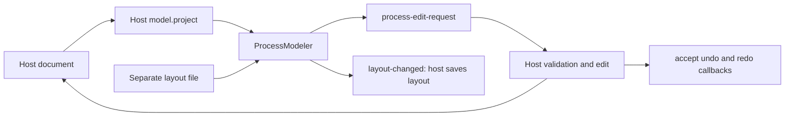

# Process modeler

`box-process-modeler` projects host documents as boxes, frames and connections.
It does not translate diagrams to workflows or save them. The host owns those
rules and can refuse unsupported shapes before changing its document.



```ts
import { ProcessModeler } from "@unofficialbox/box-open-elements/patterns/process-modeler";
const canvas = document.querySelector("box-process-modeler") as ProcessModeler;
canvas.model = { project: doc => ({ boxes: doc.boxes, lines: doc.lines }) };
canvas.document = document;
canvas.layout = { boxes: { first: { x: 40, y: 40 } } };
canvas.addEventListener("process-edit-request", event => {
  // Validate event.detail, then apply it to your document.
  // Refusal: leave the document unchanged and show setValidation([...]).
  // Acceptance: event.detail.accept({ undo: restoreBefore, redo: applyAfter });
  // Call canvas.refresh() after mutations; assigning document also refreshes.
});
canvas.addEventListener("layout-changed", event => saveLayout(event.detail.layout));
```

## Contract

- `ProcessModel.project(document)` returns boxes with stable IDs, host node
  references, kind/title, optional path and frame/parent IDs; lines have unique
  IDs, existing endpoints, optional labels, dashed style and authored points.
- `layout` is copied on assignment/read. It preserves positions/sizes, notes,
  sections and line control points separately from workflow data. Missing box
  positions receive a deterministic fallback. Hosts own path/fingerprint
  reconciliation when documents change.
- `catalog` uses `FlowKind` entries. The grouped searchable palette supports
  keyboard add or drag/drop. Add/delete/connect/disconnect/insert requests are
  delivered as `process-edit-request`; no document mutation happens implicitly.
  The host supplies reversible callbacks via `accept()` after applying an edit.
  Accepted adds use the requested drop position; document callbacks and the
  corresponding canvas layout restore together as one undoable edit.
- `move-request` is cancelable. Accepted moves and Tidy up emit `layout-changed`
  and join the same bounded history as host-accepted edits. `undo()` and `redo()`
  replay callbacks. Different external layout replacements clear history;
  controlled echoes and layout assignments inside undo/redo preserve it.
  Hosts can supply a shared `ProcessHistory` through `history`, and pass
  `() => canvas.undo()` to `patterns/undo`'s `offerUndo` for an adjacent undo
  offer. The canvas prevents duplicate keyboard handling through preventDefault.
- `resize(id, width, height)`, `routeLine(id, points)`, `setNote(note, id)` and
  `setSection(section, id)` share that history. Pass null to remove a note or
  section. These APIs let host inspector controls edit layout without replacing
  history. Tidy positions nested frame contents together; moving a frame moves
  all descendants in one undoable operation.
- `renderInspector(node, container)` may return cleanup. `setValidation(checks)`
  marks boxes by ID or path and adds selectable, announced Checks.
- `locked` blocks edits but retains navigation. `snap-to-grid` uses 20px units.
  `--boe-process-height` sets canvas height (default 560px).

## Interaction

Select boxes with pointer or Tab/Enter. Arrow keys move the selected box; Shift
moves further. C followed by another box connects them; Escape cancels. Delete
requests removal. Connection insert/remove buttons have spoken endpoint labels.
Connect selected and Delete selected also expose those operations as buttons.
Command/Control-Z and Shift-Z undo/redo. Background drag and trackpad scroll pan;
Control-wheel and two-pointer pinch zoom. Zoom buttons, 100% reset, Fit and a
click-to-jump overview provide alternatives. The overview is keyboard reachable:
arrow keys pan and Enter fits. Layout movement
has no animations and respects reduced-motion users. Light and dark consume the
same foundation tokens.

Frames are projected boxes drawn behind their children; the host owns grouping
and semantic legality. Notes/sections and hand-adjusted lines are supplied as
layout data, not workflow fields. The library does not enforce any particular
workflow's branching, loop or save rules.
