# Taxonomy

This diagram is the canonical model for the package structure, docs structure, and teaching structure of `box-open-elements`.

The system uses the industry-standard three-tier shape — **Foundations → Components → Patterns** — used by Atlassian, Shopify Polaris, and GitHub Primer (see [research/taxonomy-comparison.md](./research/taxonomy-comparison.md)). It replaces the previous repo's `Primitives → Composites → Elements` naming:

| Old tier (`box-open-web-components`) | New tier (`box-open-elements`) |
| --- | --- |
| *(unnamed: tokens, brand, iconography docs)* | `Foundations` |
| `Primitives` | `Components` |
| `Composites` + `Elements` | `Patterns` |

```mermaid
flowchart TD
    A["Box Open Elements"] --> B["Foundations"]
    A --> C["Components"]
    A --> D["Patterns"]

    B --> B1["Design Tokens"]
    B --> B2["Color"]
    B --> B3["Typography"]
    B --> B4["Iconography"]
    B --> B5["Illustrations"]
    B --> B6["Accessibility"]
    B --> B7["Theming"]
    B --> B8["Motion"]

    C --> C1["Actions"]
    C --> C2["Collections"]
    C --> C3["Feedback"]
    C --> C4["Files"]
    C --> C5["Forms"]
    C --> C6["Identity"]
    C --> C7["Layout"]
    C --> C8["Navigation"]
    C --> C9["Overlays"]
    C --> C10["Visuals"]

    D --> D1["Content Explorer"]
    D --> D2["Preview"]
    D --> D3["Search"]
    D --> D4["Item"]
    D --> D5["Metadata"]
    D --> D6["Share"]
    D --> D7["File Request"]
    D --> D8["Task"]
    D --> D9["Governance"]
    D --> D10["Insights"]
```

## Tier definitions

- `Foundations`
  - Design decisions expressed as data and guidance: design tokens, color, typography, iconography, illustrations, accessibility conventions, theming, and motion.
  - Code lives under `src/foundations/` (for example the design-token registry); guidance lives under `docs/foundations/`.
- `Components`
  - Single controls or narrowly scoped UI surfaces: buttons, inputs, overlays, collections, status surfaces.
  - Data goes in through properties, interaction comes out through events. Components never own transport.
  - Code lives under `src/components/<category>/<name>.ts`.
- `Patterns`
  - Combinations of components that address common user objectives with sequences and flows (borrowing IBM Carbon's working definition), grouped by Box noun or workflow area.
  - Patterns come in two kinds:
    - **Compositions** — display-oriented assemblies fed data via properties (share panel, filter bar, metric card). No owned transport.
    - **Workflows** — orchestrated surfaces that depend on transport contracts, headless controllers, or provider adapters (content explorer, preview shell).
  - Code lives under `src/patterns/<area>/`; each area owns its headless controllers, contracts, and composed surfaces together.

A small `src/core/` support layer (typed event emitter, controller base class) sits below all three tiers and is not itself a taxonomy tier.

## Usage

Use this taxonomy for:

- filesystem organization
- public package subpaths
- docs-site catalog structure
- tutorial structure
- future roadmap discussions

## Rules

- Put code in `foundations` when it expresses a design decision (a token value, an icon, a theming API) rather than an interactive surface.
- Put a component in `components` when it is a single control or a narrowly scoped surface.
- Put a surface in `patterns` when it assembles components into a task surface, or when it depends on orchestration, provider contracts, or Box-specific workflow structure.
- Keep category names stable once published. Prefer moving a surface between tiers only when the abstraction is genuinely wrong.
- Tutorial scenarios should move upward through the taxonomy: start with a foundation or component, end with a working pattern-level result.
