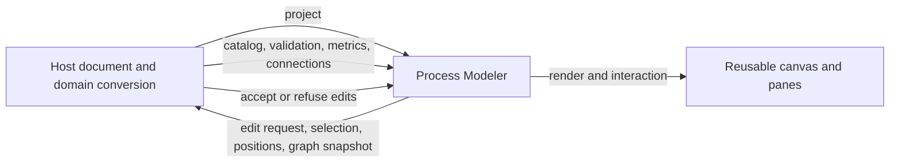

# Process Modeler design rebuild

Status: implementation on `codex/process-modeler-design-rebuild`; automated
verification complete, product-side acceptance pending.

## Decision record

- Replace the v0.25 Process Modeler presentation and interaction model. Preserve
  proven host-neutral graph, layout, and history algorithms only where they
  serve the pinned Riptide Diagram design (report #321, issues #322–331).
- The pinned Riptide Diagram page is the visual and behavioral reference at
  1440px and 390px, light and dark. Do not reinterpret it.
- Riptide owns workflow conversion, schema, persistence, and save policy. The
  library owns a host-neutral projection, layout, selection, edit requests,
  validation display, and accessible rendering. It must never import Riptide IR.
- Preserve the unfinished `codex/safari-modeler-focus` work in its original
  checkout; this worktree starts from `origin/main`.

## Delivery slices

1. **Contract and topology (#326, #331, #320):** host-defined branching and
   validation; graph snapshots only when valid; stable path/fingerprint layout;
   connections and metrics input; documented events and tests.
2. **Canvas anatomy (#322–324):** 16px snap, 208×136 minimap, design-sized
   cards/gateways/events/frames/notes/sections, orthogonal lines/ports and
   insert/drop affordances, grouped two-line searchable catalog.
3. **Inspector and views (#325, #327):** outline/checks/variables/connections/
   shortcuts, host-rendered domain fields, business/technical descriptions and
   optional last-run numbers.
4. **Selection and access (#328–330):** anchored selection toolbar, arrange and
   copy/duplicate shortcuts, directional keyboard navigation, focus return,
   announcements, <900px palette and details drawers, reduced motion.
5. **Proof:** focused tests; `bun run verify`; conformance and pinned visual
   regression; Playwright side-by-side at 1440/390 in light/dark; keyboard,
   interaction, console, contrast and axe checks. Record any remaining parity
   gaps explicitly before review.

## Host boundary

## Reference and verification

- Reference: `box-riptide` commit `8cbbe799569b75fe346abac81dfad7628ede824d`,
  `ui/studio/public/modeler/index.html`.
- Design practices: `box-riptide/ui/studio/DESIGN.md` and
  `docs/patterns/builder-editor-guidelines.md`.
- The reference is a whole-page application; a library component omits the
  host's Save, Steps/Code switch, title, run activation, and connection setup.
  It must match the design's canvas, palette, inspector, states, and responsive
  composition within its own host rectangle.

## Acceptance record

| Issues | Implemented in this branch | Acceptance still needed |
| --- | --- | --- |
| #322–324 | Reference-sized canvas and boxes, grouped catalog, lines/ports, pinned sides, drag previews, frame resizing, reader notes and sections | Side-by-side product review of routing and motion on Riptide's real workflow |
| #325 | Controlled fields, grouped action combobox, expressions and variable chips, selection/outline/checks/connections panels | Riptide supplies actual action catalog, per-kind field descriptors and CEL validation |
| #326, #320 | Host-authoritative read-back checks, hold banner, last readable drawing | Riptide implements workflow conversion and save gate, as explicitly assigned |
| #327–328 | Business/technical view, optional run metrics, selection toolbar, multi-select and arranging | Product review of host-provided run data |
| #329–331 | Keyboard model, accessible names, announcements, mobile drawers and embed/position APIs | Manual Safari + VoiceOver pass and Riptide host integration |

Verification: 106 focused Process Modeler tests passed; final `bun run verify`
passed with 2,392 tests and 88.46% line coverage, including the core and all
four framework builds. Final pinned container pixel regression passed 14/14
gallery and 63/63 docs baselines without updates. BUE conformance reported
0 drift. Playwright desktop/mobile interaction and axe WCAG A/AA checks were
clean in light and dark themes, with no console errors. The host-only pixel
run was not used for baselines because it differed on 76 unrelated images;
the pinned container run passed without baseline updates. Human screen-reader
and Riptide-host acceptance remain open.
